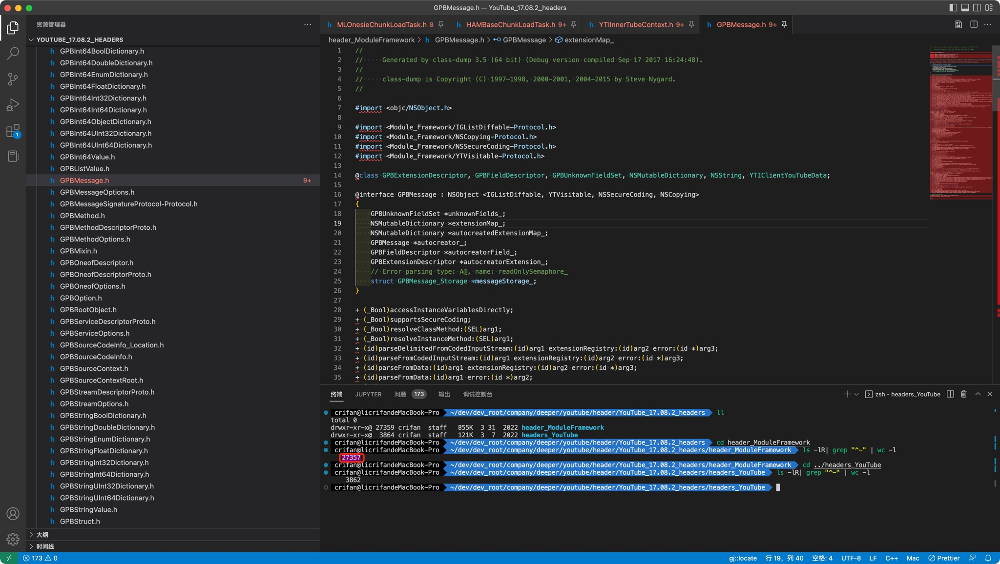
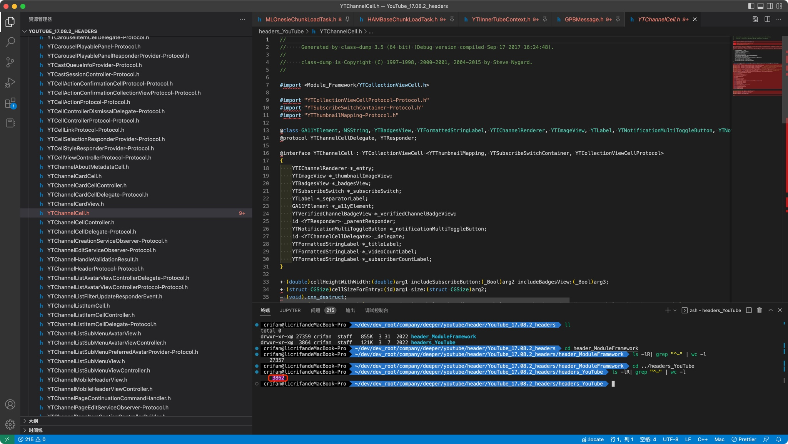

# 导出头文件

TODO：

* 【记录】class-dump导出头文件：YouTube的动态库二进制Module_Framework
* 【未解决】class-dump导出YouTube头文件报错：Unknown load command 0x00000032
* 【已解决】Mac中用class-dump导出YouTube头文件

---

用`class-dump`导出`YouTube`的头文件

此处`YouTube`有2个二进制：

* `YouTube`
* `Module_Framework`

所以要分别导出对应的头文件。

导出后的效果：

* 2.7万多个头文件
  * 
* 3800多个头文件
  * 
